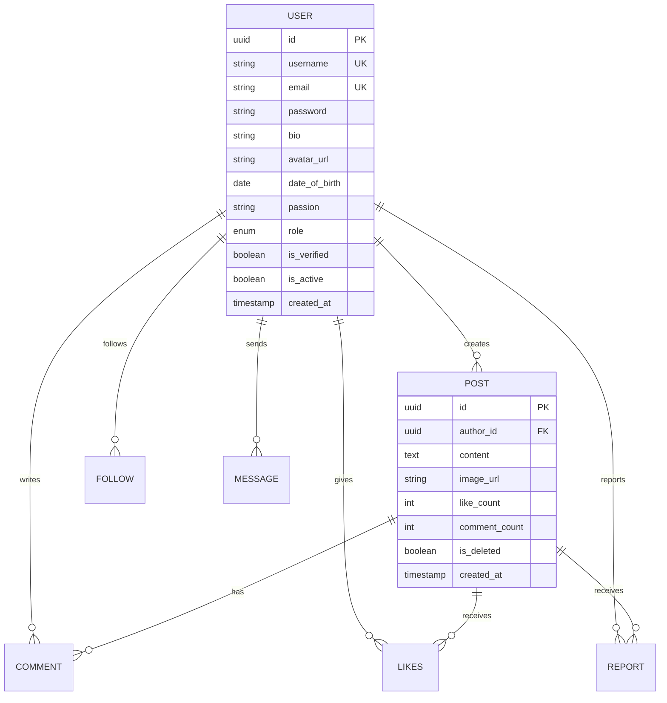

<div align="center">

# 🌐 ConnectSphere

### *Where Connections Come Alive*

[](https://spring.io/projects/spring-boot)
[](https://react.dev)
[](https://www.postgresql.org)
[](https://redis.io)
[](https://kafka.apache.org)
[](https://www.docker.com)
[](https://aws.amazon.com)
[](LICENSE)

<br/>

A **production-grade social media platform** built with modern distributed systems architecture.  
Real-time messaging • Event-driven feeds • Cloud-native deployment

<br/>

[🚀 Getting Started](#-getting-started) •
[✨ Features](#-features) •
[🏗️ Architecture](#️-architecture) •
[📡 API Docs](#-api-documentation) •
[🧪 Testing](#-testing)

<br/>

---

</div>

<br/>

## 📸 Screenshots

<div align="center">
<table>
<tr>
<td align="center"><b>📱 News Feed</b></td>
<td align="center"><b>👤 User Profile</b></td>
</tr>
<tr>
<td></td>
<td></td>
</tr>
<tr>
<td align="center"><b>💬 Real-time Chat</b></td>
<td align="center"><b>📊 Admin Dashboard</b></td>
</tr>
<tr>
<td></td>
<td></td>
</tr>
</table>
</div>

<br/>

## ⚡ What Makes This Different?

> This isn't another CRUD app with a fancy name.  
> **ConnectSphere** is engineered with the same patterns used by Twitter, Instagram, and LinkedIn.

| Challenge | How ConnectSphere Solves It |
|-----------|---------------------------|
| 📨 **Feed delivery at scale** | Kafka-powered fan-out writes to follower feeds asynchronously |
| ⚡ **Real-time messaging** | WebSocket + STOMP for instant 1:1 chat with presence detection |
| 🚀 **Sub-100ms API responses** | Redis caching layer for feeds, profiles & session management |
| 🔐 **Enterprise-grade auth** | JWT + OAuth2 (Google/GitHub) with email verification & refresh tokens |
| ☁️ **Cloud-native deployment** | Dockerized services deployed to AWS via Jenkins CI/CD pipeline |
| 📦 **Media at scale** | AWS S3 with pre-signed URLs for secure, direct uploads |

<br/>

## ✨ Features

### 👤 User Experience
```
✅ Email + Password Registration with Email Verification
✅ OAuth2 Login (Google & GitHub) with Smart Username Generation
✅ Forgot Password / Reset Password Flow
✅ Rich User Profiles — Bio, Avatar, DOB, Passions
✅ Follow / Unfollow System with Follower & Following Counts
✅ Create, Edit & Delete Posts (Text + Image, 10K word limit)
✅ Like & Comment on Posts
✅ Personalized News Feed (posts from people you follow)
✅ Full-Text Search — Users & Posts
✅ Real-time 1:1 Chat with Online/Offline Status
✅ Report Inappropriate Content
```

### 🛡️ Admin Panel
```
✅ Platform Analytics Dashboard
✅ User Growth Charts (Daily / Weekly / Monthly)
✅ User Management — View, Ban, Delete
✅ Content Moderation — Review & Remove Reported Posts
✅ Most Active Users & Engagement Metrics
```

<br/>

## 🏗️ Architecture

```
┌─────────────────────────────────────────────────────────────────┐
│                        CLIENT LAYER                             │
│                   React.js (Vite + Axios)                       │
└──────────────────────────┬──────────────────────────────────────┘
                           │ HTTPS
                           ▼
┌─────────────────────────────────────────────────────────────────┐
│                      API GATEWAY / LB                           │
│                   AWS ALB + NGINX                               │
└──────────────────────────┬──────────────────────────────────────┘
                           │
                           ▼
┌─────────────────────────────────────────────────────────────────┐
│                    APPLICATION LAYER                            │
│               Spring Boot 3.2 (Java 17+)                        │
│                                                                 │
│  ┌──────────┐  ┌──────────┐  ┌──────────┐  ┌──────────────┐     │
│  │   Auth   │  │   User   │  │   Post   │  │     Chat     │     │
│  │ Service  │  │ Service  │  │ Service  │  │   WebSocket  │     │
│  └────┬─────┘  └────┬─────┘  └────┬─────┘  └──────┬───────┘     │
│       │             │             │               │             │
│  ┌────▼─────────────▼─────────────▼───────────────▼────────┐    │
│  │              Spring Security + JWT Filter               │    │
│  └─────────────────────────────────────────────────────────┘    │
└──────────┬──────────────┬──────────────┬──────────────┬─────────┘
           │              │              │              │
           ▼              ▼              ▼              ▼
┌──────────────┐  ┌──────────────┐  ┌────────┐  ┌───────────┐
│ PostgreSQL   │  │    Redis     │  │ Kafka  │  │  AWS S3   │
│   (RDS)      │  │(ElastiCache) │  │ (MSK)  │  │  (Media)  │
│              │  │              │  │        │  │           │
│ • Users      │  │ • Feed Cache │  │Topics: │  │ • Avatars │
│ • Posts      │  │ • Sessions   │  │post.   │  │ • Post    │
│ • Comments   │  │ • Rate Limit │  │created │  │   Images  │
│ • Follows    │  │ • Online     │  │chat.   │  │           │
│ • Messages   │  │   Status     │  │message │  │           │
│ • Reports    │  │              │  │user.   │  │           │
│              │  │              │  │signup  │  │           │
└──────────────┘  └──────────────┘  └────────┘  └───────────┘
```

<br/>

## 🛠️ Tech Stack

<div align="center">

| Layer | Technology | Purpose |
|:-----:|:---------:|:-------:|
| **Backend** |  | REST API, Business Logic, Security |
| **Frontend** |  | User Interface |
| **Database** |  | Primary Data Store |
| **Cache** |  | Caching, Sessions, Rate Limiting |
| **Streaming** |  | Event-Driven Feed & Chat |
| **Real-time** |  | Live Chat (STOMP + SockJS) |
| **Storage** |  | Media File Storage |
| **Hosting** |  | Cloud Deployment |
| **CI/CD** |  | Automated Pipeline |
| **Container** |  | Containerization |
| **Docs** |  | API Documentation |

</div>

<br/>

## 🚀 Getting Started

### Prerequisites

```bash
Java 17+
Node.js 18+
Docker & Docker Compose
PostgreSQL 16
Redis 7
Apache Kafka
```

### 1️⃣ Clone the Repository

```bash
git clone https://github.com/yourusername/connectsphere-backend.git
cd connectsphere-backend
```

### 2️⃣ Start Infrastructure (Docker)

```bash
docker-compose up -d
```

This spins up PostgreSQL, Redis, Kafka, and Zookeeper.

### 3️⃣ Configure Environment

```bash
cp src/main/resources/application-dev.example.yml src/main/resources/application-dev.yml
```

Update with your credentials:

```yaml
# application-dev.yml
spring:
  datasource:
    url: jdbc:postgresql://localhost:5432/connectsphere
    username: your_username
    password: your_password

  redis:
    host: localhost
    port: 6379

aws:
  s3:
    bucket: your-bucket-name
    access-key: YOUR_ACCESS_KEY
    secret-key: YOUR_SECRET_KEY

jwt:
  secret: your-256-bit-secret-key
  expiration: 900000        # 15 minutes
  refresh-expiration: 604800000  # 7 days

oauth2:
  google:
    client-id: YOUR_GOOGLE_CLIENT_ID
    client-secret: YOUR_GOOGLE_SECRET
  github:
    client-id: YOUR_GITHUB_CLIENT_ID
    client-secret: YOUR_GITHUB_SECRET
```

### 4️⃣ Run the Application

```bash
./mvnw spring-boot:run -Dspring-boot.run.profiles=dev
```

The API will be available at `http://localhost:8080`

### 5️⃣ Access Swagger Docs

```
http://localhost:8080/swagger-ui.html
```

<br/>

## 📡 API Documentation

### 🔐 Authentication
| Method | Endpoint | Description |
|:------:|----------|-------------|
| `POST` | `/api/v1/auth/register` | Register new user |
| `POST` | `/api/v1/auth/login` | Login (returns JWT) |
| `POST` | `/api/v1/auth/oauth/google` | Google OAuth login |
| `POST` | `/api/v1/auth/oauth/github` | GitHub OAuth login |
| `GET` | `/api/v1/auth/verify-email` | Verify email token |
| `POST` | `/api/v1/auth/forgot-password` | Request password reset |
| `POST` | `/api/v1/auth/reset-password` | Reset password |
| `POST` | `/api/v1/auth/refresh-token` | Refresh JWT token |

### 👤 Users
| Method | Endpoint | Description |
|:------:|----------|-------------|
| `GET` | `/api/v1/users/me` | Get my profile |
| `PUT` | `/api/v1/users/me` | Update my profile |
| `POST` | `/api/v1/users/me/avatar` | Upload avatar |
| `GET` | `/api/v1/users/{id}` | Get user profile |
| `GET` | `/api/v1/users/search?q=` | Search users |
| `POST` | `/api/v1/users/{id}/follow` | Follow user |
| `DELETE` | `/api/v1/users/{id}/follow` | Unfollow user |
| `GET` | `/api/v1/users/{id}/followers` | Get followers |
| `GET` | `/api/v1/users/{id}/following` | Get following |

### 📝 Posts
| Method | Endpoint | Description |
|:------:|----------|-------------|
| `POST` | `/api/v1/posts` | Create post |
| `GET` | `/api/v1/posts/{id}` | Get post |
| `PUT` | `/api/v1/posts/{id}` | Edit post |
| `DELETE` | `/api/v1/posts/{id}` | Delete post |
| `GET` | `/api/v1/posts/feed` | Get news feed |
| `POST` | `/api/v1/posts/{id}/like` | Toggle like |
| `POST` | `/api/v1/posts/{id}/comments` | Add comment |
| `GET` | `/api/v1/posts/search?q=` | Search posts |

### 💬 Chat
| Method | Endpoint | Description |
|:------:|----------|-------------|
| `WS` | `/ws/chat` | WebSocket connection |
| `GET` | `/api/v1/chat/conversations` | Get conversations |
| `GET` | `/api/v1/chat/{userId}/messages` | Get message history |

### 🛡️ Admin
| Method | Endpoint | Description |
|:------:|----------|-------------|
| `GET` | `/api/v1/admin/dashboard` | Dashboard stats |
| `GET` | `/api/v1/admin/users` | List all users |
| `PUT` | `/api/v1/admin/users/{id}/ban` | Ban/Unban user |
| `DELETE` | `/api/v1/admin/users/{id}` | Delete user |
| `GET` | `/api/v1/admin/reports` | View reports |
| `GET` | `/api/v1/admin/analytics/growth` | Growth analytics |

> 📖 Full interactive docs available at `/swagger-ui.html` when running locally.

<br/>

## 📂 Project Structure

```
connectsphere-backend/
│
├── 📁 src/main/java/com/connectsphere/
│   ├── 🚀 ConnectSphereApplication.java
│   │
│   ├── 📁 config/          # Security, JWT, WebSocket, Redis, Kafka, S3, Swagger
│   ├── 📁 controller/      # REST endpoints (Auth, User, Post, Chat, Admin)
│   ├── 📁 service/         # Business logic layer
│   ├── 📁 repository/      # JPA data access layer
│   ├── 📁 entity/          # Database entities (User, Post, Comment, etc.)
│   ├── 📁 dto/             # Request & Response DTOs
│   │   ├── 📁 request/     # Incoming payloads
│   │   └── 📁 response/    # Outgoing payloads + ApiResponse<T>
│   ├── 📁 security/        # JWT filter, OAuth2 handler, UserDetails
│   ├── 📁 websocket/       # Chat WebSocket handler & events
│   ├── 📁 kafka/           # Producer, Consumer, Topic configs
│   ├── 📁 exception/       # Global exception handler + custom exceptions
│   └── 📁 util/            # Constants, helpers
│
├── 📁 src/main/resources/
│   ├── application.yml
│   ├── application-dev.yml
│   └── application-prod.yml
│
├── 🐳 Dockerfile
├── 🐳 docker-compose.yml
├── 🔧 Jenkinsfile
├── 📦 pom.xml
└── 📖 README.md
```

<br/>

## 🗄️ Database Schema



<br/>

## 🧪 Testing

```bash
# Run all unit tests
./mvnw test

# Run integration tests
./mvnw verify -P integration-tests

# Run with coverage report
./mvnw test jacoco:report

# Load test with k6 (1000 virtual users)
k6 run load-tests/fanout-test.js
```

<br/>

## 🚢 Deployment

### Docker

```bash
# Build image
docker build -t connectsphere:latest .

# Run full stack
docker-compose -f docker-compose.prod.yml up -d
```

### CI/CD Pipeline (Jenkins)

```
GitHub Push → Jenkins → Maven Build → Tests → Docker Build → Push to ECR → Deploy to AWS
```

```
 ┌──────────┐    ┌──────────┐    ┌──────────┐    ┌──────────┐    ┌──────────┐    ┌──────────┐    ┌──────────┐
 │ Git Push │───▶│ Jenkins  │───▶│  Maven   │───▶│   Run    │───▶│  Docker  │───▶│ Push to  │───▶│ Deploy   │
 │          │    │ Trigger  │    │  Build   │    │  Tests   │    │  Build   │    │   ECR    │    │  to AWS  │
 └──────────┘    └──────────┘    └──────────┘    └──────────┘    └──────────┘    └──────────┘    └──────────┘
     🟢               ⚙️              📦             🧪              🐳              ☁️              🚀
```

<br/>

## Contributing

Contributions are welcome! Please follow these steps:

1. **Fork** the repository
2. **Create** your feature branch (`git checkout -b feature/amazing-feature`)
3. **Commit** your changes (`git commit -m 'Add amazing feature'`)
4. **Push** to the branch (`git push origin feature/amazing-feature`)
5. **Open** a Pull Request


---

<div align="center">

**Prepared By [Manish](https://github.com/mr-mk-dev), with help of [Claude AI](https://claude.ai/)**

⭐ Star this repo if you found it helpful!

[](https://github.com/yourusername/connectsphere)
[](https://linkedin.com/in/yourprofile)

</div>
