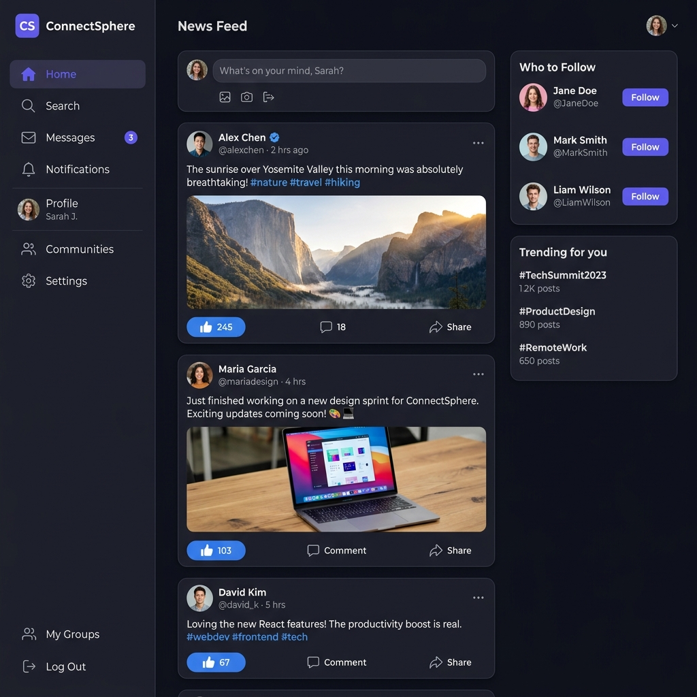
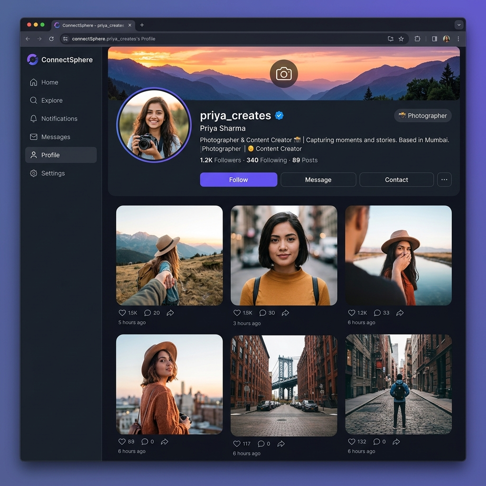
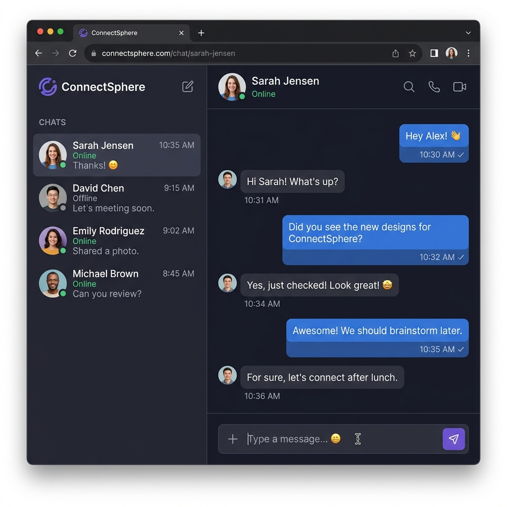
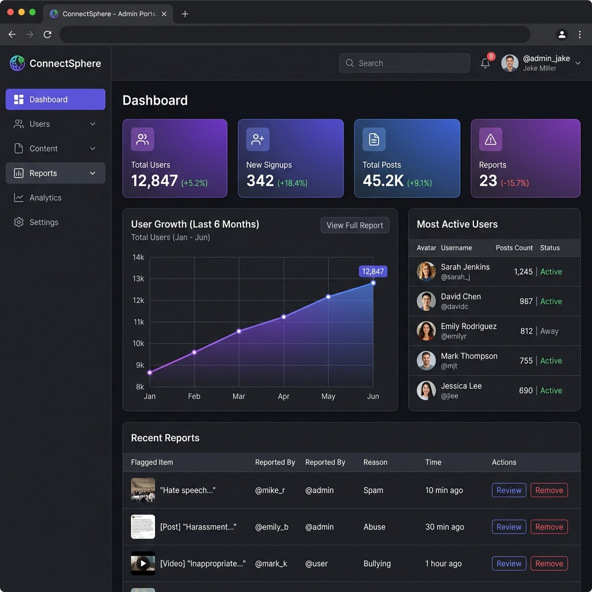
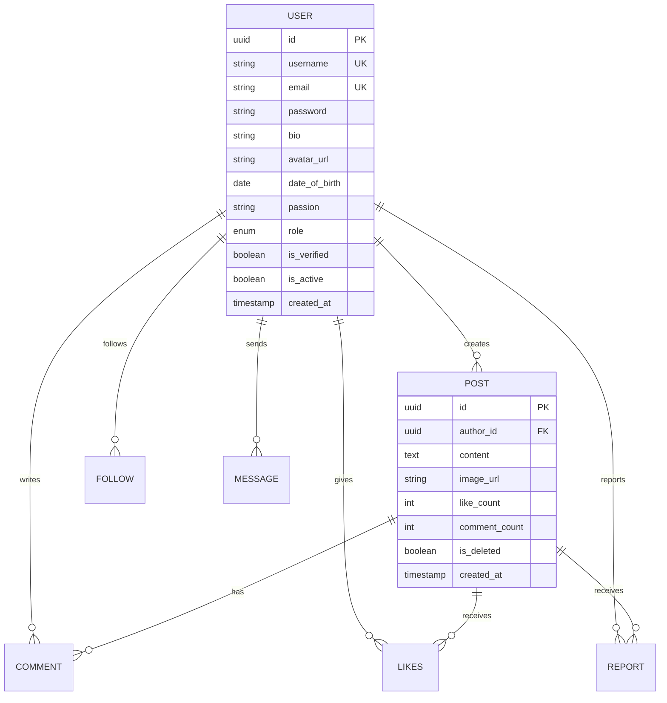

<div align="center">

# 🌐 ConnectSphere

### *Where Connections Come Alive*

[](https://spring.io/projects/spring-boot)
[](https://react.dev)
[](https://www.postgresql.org)
[](https://redis.io)
[](https://kafka.apache.org)
[](https://www.docker.com)
[](https://aws.amazon.com)
[](LICENSE)

<br/>

A **production-grade social media platform** built with modern distributed systems architecture.  
Real-time messaging • Event-driven feeds • Cloud-native deployment

<br/>

[🚀 Getting Started](#-getting-started) •
[✨ Features](#-features) •
[🏗️ Architecture](#️-architecture) •
[📡 API Docs](#-api-documentation) •
[🧪 Testing](#-testing)

<br/>

---

</div>

<br/>

## 📸 Screenshots

<div align="center">
<table>
<tr>
<td align="center"><b>📱 News Feed</b></td>
<td align="center"><b>👤 User Profile</b></td>
</tr>
<tr>
<td></td>
<td></td>
</tr>
<tr>
<td align="center"><b>💬 Real-time Chat</b></td>
<td align="center"><b>📊 Admin Dashboard</b></td>
</tr>
<tr>
<td></td>
<td></td>
</tr>
</table>
</div>

<br/>

## ⚡ What Makes This Different?

> This isn't another CRUD app with a fancy name.  
> **ConnectSphere** is engineered with the same patterns used by Twitter, Instagram, and LinkedIn.

| Challenge | How ConnectSphere Solves It |
|-----------|---------------------------|
| 📨 **Feed delivery at scale** | Kafka-powered fan-out writes to follower feeds asynchronously |
| ⚡ **Real-time messaging** | WebSocket + STOMP for instant 1:1 chat with presence detection |
| 🚀 **Sub-100ms API responses** | Redis caching layer for feeds, profiles & session management |
| 🔐 **Enterprise-grade auth** | JWT + OAuth2 (Google/GitHub) with email verification & refresh tokens |
| ☁️ **Cloud-native deployment** | Dockerized services deployed to AWS via Jenkins CI/CD pipeline |
| 📦 **Media at scale** | AWS S3 with pre-signed URLs for secure, direct uploads |

<br/>

## ✨ Features

### 👤 User Experience
```
✅ Email + Password Registration with Email Verification
✅ OAuth2 Login (Google & GitHub) with Smart Username Generation
✅ Forgot Password / Reset Password Flow
✅ Rich User Profiles — Bio, Avatar, DOB, Passions
✅ Follow / Unfollow System with Follower & Following Counts
✅ Create, Edit & Delete Posts (Text + Image, 10K word limit)
✅ Like & Comment on Posts
✅ Personalized News Feed (posts from people you follow)
✅ Full-Text Search — Users & Posts
✅ Real-time 1:1 Chat with Online/Offline Status
✅ Report Inappropriate Content
```

### 🛡️ Admin Panel
```
✅ Platform Analytics Dashboard
✅ User Growth Charts (Daily / Weekly / Monthly)
✅ User Management — View, Ban, Delete
✅ Content Moderation — Review & Remove Reported Posts
✅ Most Active Users & Engagement Metrics
```

<br/>

## 📊 Development Progress

> Current Status: **Auth + User Module Complete** — actively building Post module.

| Module | Status | Details |
|--------|--------|---------|
| 🏗️ **Project Setup** | ✅ Done | Spring Boot 4.0, Maven, Docker, Jenkinsfile |
| 🗄️ **Entity Layer** | ✅ Done | User, Post, Comment, Like, Follow, Message, Report |
| 📦 **Repository Layer** | ✅ Done | JPA repos for all 7 entities + custom JPQL queries |
| 🔢 **Enums** | ✅ Done | Role, AuthProvider, Passion, ReportReason, ReportStatus |
| 🔐 **Authentication Module** | ✅ Done | Register, Login, Email Verify, Forgot/Reset Password, JWT |
| 📧 **Email Service** | ✅ Done | Verification & password reset email flows |
| 🛡️ **Security Layer** | ✅ Done | JWT Filter, CustomUserDetails, JwtTokenProvider |
| ⚙️ **Config** | ✅ Done | SecurityConfig, RedisConfig, SwaggerConfig, DataSeeder |
| ⚠️ **Exception Handling** | ✅ Done | GlobalExceptionHandler + 8 custom exceptions |
| 📋 **DTOs** | ✅ Done | ApiResponse, AuthResponse, UserResponse, UpdateProfileRequest + Auth DTOs |
| 👤 **User Module** | ✅ Done | Get/Update profile, Get by ID, Paginated search sorted by followers |
| 📖 **API Documentation** | ✅ Done | Swagger UI via springdoc-openapi with JWT auth support |
| 🌱 **Test Data Seeder** | ✅ Done | Auto-seeds 500 users + follow relationships on local startup |
| 📝 **Post Module** | 🚧 Next | Create/Edit/Delete posts, News feed, Likes, Comments |
| 🔗 **Follow Module** | 🚧 Next | Follow/Unfollow, followers list, following list |
| 💬 **Chat Module** | 🚧 Planned | WebSocket, 1:1 messaging, online presence |
| 🛡️ **Admin Module** | 🚧 Planned | Dashboard, user management, content moderation |
| 📨 **Kafka Integration** | 🚧 Planned | Event-driven feed fan-out, chat events |
| ☁️ **AWS S3** | 🚧 Planned | Media uploads (avatars, post images) |
| 🖥️ **Frontend (React)** | 🚧 Planned | Full UI with Vite + Axios |

<br/>

## 🏗️ Architecture

```
┌─────────────────────────────────────────────────────────────────┐
│                        CLIENT LAYER                             │
│                   React.js (Vite + Axios)                       │
└──────────────────────────┬──────────────────────────────────────┘
                           │ HTTPS
                           ▼
┌─────────────────────────────────────────────────────────────────┐
│                      API GATEWAY / LB                           │
│                   AWS ALB + NGINX                               │
└──────────────────────────┬──────────────────────────────────────┘
                           │
                           ▼
┌─────────────────────────────────────────────────────────────────┐
│                    APPLICATION LAYER                            │
│               Spring Boot 3.2 (Java 17+)                        │
│                                                                 │
│  ┌──────────┐  ┌──────────┐  ┌──────────┐  ┌──────────────┐     │
│  │   Auth   │  │   User   │  │   Post   │  │     Chat     │     │
│  │ Service  │  │ Service  │  │ Service  │  │   WebSocket  │     │
│  └────┬─────┘  └────┬─────┘  └────┬─────┘  └──────┬───────┘     │
│       │             │             │               │             │
│  ┌────▼─────────────▼─────────────▼───────────────▼────────┐    │
│  │              Spring Security + JWT Filter               │    │
│  └─────────────────────────────────────────────────────────┘    │
└──────────┬──────────────┬──────────────┬──────────────┬─────────┘
           │              │              │              │
           ▼              ▼              ▼              ▼
┌──────────────┐  ┌──────────────┐  ┌────────┐  ┌───────────┐
│ PostgreSQL   │  │    Redis     │  │ Kafka  │  │  AWS S3   │
│   (RDS)      │  │(ElastiCache) │  │ (MSK)  │  │  (Media)  │
│              │  │              │  │        │  │           │
│ • Users      │  │ • Feed Cache │  │Topics: │  │ • Avatars │
│ • Posts      │  │ • Sessions   │  │post.   │  │ • Post    │
│ • Comments   │  │ • Rate Limit │  │created │  │   Images  │
│ • Follows    │  │ • Online     │  │chat.   │  │           │
│ • Messages   │  │   Status     │  │message │  │           │
│ • Reports    │  │              │  │user.   │  │           │
│              │  │              │  │signup  │  │           │
└──────────────┘  └──────────────┘  └────────┘  └───────────┘
```

<br/>

## 🛠️ Tech Stack

<div align="center">

| Layer | Technology | Purpose |
|:-----:|:---------:|:-------:|
| **Backend** |  | REST API, Business Logic, Security |
| **Frontend** |  | User Interface |
| **Database** |  | Primary Data Store |
| **Cache** |  | Caching, Sessions, Rate Limiting |
| **Streaming** |  | Event-Driven Feed & Chat |
| **Real-time** |  | Live Chat (STOMP + SockJS) |
| **Storage** |  | Media File Storage |
| **Hosting** |  | Cloud Deployment |
| **CI/CD** |  | Automated Pipeline |
| **Container** |  | Containerization |
| **Docs** |  | API Documentation |

</div>

<br/>

## 🚀 Getting Started

### Prerequisites

```bash
Java 17+
Node.js 18+
Docker & Docker Compose
PostgreSQL 16
Redis 7
Apache Kafka
```

### 1️⃣ Clone the Repository

```bash
git clone https://github.com/mr-mk-dev/ConnectSphere.git
cd ConnectSphere
```

### 2️⃣ Start Infrastructure (Docker)

```bash
docker-compose up -d
```

This spins up PostgreSQL, Redis, Kafka, and Zookeeper.

### 3️⃣ Configure Environment

```bash
cp src/main/resources/application-dev.example.yml src/main/resources/application-dev.yml
```

Update with your credentials:

```yaml
# application-dev.yml
spring:
  datasource:
    url: jdbc:postgresql://localhost:5432/connectsphere
    username: your_username
    password: your_password

  redis:
    host: localhost
    port: 6379

aws:
  s3:
    bucket: your-bucket-name
    access-key: YOUR_ACCESS_KEY
    secret-key: YOUR_SECRET_KEY

jwt:
  secret: your-256-bit-secret-key
  expiration: 900000        # 15 minutes
  refresh-expiration: 604800000  # 7 days

oauth2:
  google:
    client-id: YOUR_GOOGLE_CLIENT_ID
    client-secret: YOUR_GOOGLE_SECRET
  github:
    client-id: YOUR_GITHUB_CLIENT_ID
    client-secret: YOUR_GITHUB_SECRET
```

### 4️⃣ Run the Application

```bash
./mvnw spring-boot:run -Dspring-boot.run.profiles=dev
```

The API will be available at `http://localhost:8080`

### 5️⃣ Access Swagger Docs

```
http://localhost:8080/swagger-ui.html
```

<br/>

## 📡 API Documentation

> 📖 Full interactive docs with request/response schemas available at `http://localhost:8080/swagger-ui.html`

### 🔐 Authentication — `/api/v1/auth` — Public (no token needed)
| Method | Endpoint | Auth | Description |
|:------:|----------|:----:|-------------|
| `POST` | `/api/v1/auth/register` | 🔓 | Register new user + sends verification email |
| `POST` | `/api/v1/auth/login` | 🔓 | Login — returns JWT token |
| `GET` | `/api/v1/auth/verify-email?token=` | 🔓 | Activate account via email link |
| `POST` | `/api/v1/auth/forgot-password` | 🔓 | Send password reset email |
| `POST` | `/api/v1/auth/reset-password` | 🔓 | Reset password with token |

### 👤 Users — `/api/v1/users` — 🔐 JWT Required
| Method | Endpoint | Description |
|:------:|----------|-------------|
| `GET` | `/api/v1/users/me` | Get my profile |
| `PUT` | `/api/v1/users/me` | Update profile (bio, username, passion, DOB, avatar) |
| `GET` | `/api/v1/users/{id}` | Get any user's public profile by UUID |
| `GET` | `/api/v1/users/search?q=&page=0&size=10` | Search users by name/email — sorted by followers |

### 📝 Posts — `/api/v1/posts` — 🚧 Coming Soon
| Method | Endpoint | Description |
|:------:|----------|-------------|
| `POST` | `/api/v1/posts` | Create post |
| `GET` | `/api/v1/posts/{id}` | Get post |
| `PUT` | `/api/v1/posts/{id}` | Edit post |
| `DELETE` | `/api/v1/posts/{id}` | Delete post |
| `GET` | `/api/v1/posts/feed` | Get personalized news feed |
| `POST` | `/api/v1/posts/{id}/like` | Toggle like |
| `POST` | `/api/v1/posts/{id}/comments` | Add comment |

### 🔗 Follow — `/api/v1/users` — 🚧 Coming Soon
| Method | Endpoint | Description |
|:------:|----------|-------------|
| `POST` | `/api/v1/users/{id}/follow` | Follow a user |
| `DELETE` | `/api/v1/users/{id}/follow` | Unfollow a user |
| `GET` | `/api/v1/users/{id}/followers` | Get user's followers |
| `GET` | `/api/v1/users/{id}/following` | Get user's following list |

### 💬 Chat — `/api/v1/chat` — 🚧 Coming Soon
| Method | Endpoint | Description |
|:------:|----------|-------------|
| `WS` | `/ws/chat` | WebSocket connection (STOMP) |
| `GET` | `/api/v1/chat/conversations` | Get all conversations |
| `GET` | `/api/v1/chat/{userId}/messages` | Get message history |

### 🛡️ Admin — `/api/v1/admin` — 🚧 Coming Soon
| Method | Endpoint | Description |
|:------:|----------|-------------|
| `GET` | `/api/v1/admin/dashboard` | Platform analytics |
| `GET` | `/api/v1/admin/users` | List all users |
| `PUT` | `/api/v1/admin/users/{id}/ban` | Ban/Unban user |
| `DELETE` | `/api/v1/admin/users/{id}` | Delete user |
| `GET` | `/api/v1/admin/reports` | View content reports |

<br/>

## 📂 Project Structure

```
connectsphere/
│
├── 📁 src/main/java/me/manishcodes/connectsphere/
│   ├── 🚀 ConnectSphereApplication.java
│   │
│   ├── 📁 config/                    ✅ Implemented
│   │   ├── SecurityConfig.java       ✅ JWT + route rules
│   │   ├── RedisConfig.java          ✅ Redis template
│   │   ├── SwaggerConfig.java        ✅ OpenAPI + JWT auth button
│   │   └── DataSeeder.java           ✅ Auto-seeds 500 users on local startup
│   │
│   ├── 📁 controller/
│   │   ├── AuthController.java       ✅ 5 endpoints
│   │   ├── UserController.java       ✅ 4 endpoints
│   │   └── PublicController.java     ✅
│   │
│   ├── 📁 service/
│   │   ├── AuthService.java          ✅
│   │   ├── UserService.java          ✅ Profile CRUD + paginated search
│   │   └── EmailService.java         ✅
│   │
│   ├── 📁 repository/
│   │   ├── UserRepository.java       ✅ + JPQL search sorted by followers
│   │   ├── PostRepository.java       ✅
│   │   ├── CommentRepository.java    ✅
│   │   ├── LikeRepository.java       ✅
│   │   ├── FollowRepository.java     ✅
│   │   ├── MessageRepository.java    ✅
│   │   └── ReportRepository.java     ✅
│   │
│   ├── 📁 entity/                    ✅ All 7 entities
│   │   ├── User.java
│   │   ├── Post.java
│   │   ├── Comment.java
│   │   ├── Like.java
│   │   ├── Follow.java
│   │   ├── Message.java
│   │   └── Report.java
│   │
│   ├── 📁 dto/
│   │   ├── 📁 request/
│   │   │   ├── RegisterRequest.java  ✅
│   │   │   ├── LoginRequest.java     ✅
│   │   │   ├── UpdateProfileRequest.java ✅
│   │   │   ├── ForgotPasswordRequest.java ✅
│   │   │   └── ResetPasswordRequest.java  ✅
│   │   └── 📁 response/
│   │       ├── ApiResponse.java      ✅
│   │       ├── AuthResponse.java     ✅
│   │       └── UserResponse.java     ✅
│   │
│   ├── 📁 security/                  ✅ Fully implemented
│   │   ├── JwtTokenProvider.java
│   │   ├── JwtAuthenticationFilter.java
│   │   ├── CustomUserDetails.java
│   │   └── CustomUserDetailsService.java
│   │
│   ├── 📁 enums/                     ✅ Fully implemented
│   │   ├── Role.java
│   │   ├── AuthProvider.java
│   │   ├── Passion.java              ✅ 30 passion categories
│   │   ├── ReportReason.java
│   │   └── ReportStatus.java
│   │
│   ├── 📁 exception/                 ✅ Fully implemented
│   │   ├── GlobalExceptionHandler.java
│   │   ├── ResourceNotFoundException.java
│   │   ├── DuplicateResourceException.java
│   │   ├── AccountNotVerifiedException.java
│   │   ├── AccountBannedException.java
│   │   ├── UnauthorizedException.java
│   │   ├── ForbiddenException.java
│   │   └── FileUploadException.java
│   │
│   ├── 📁 websocket/                 🚧 Planned
│   ├── 📁 kafka/                     🚧 Planned
│   └── 📁 util/                      🚧 Planned
│
├── 📁 src/main/resources/
│   ├── application.yaml
│   └── seed_users.sql                (manual alternative to DataSeeder)
│
├── 🐳 Dockerfile
├── 🐳 docker-compose.yml
├── 🔧 Jenkinsfile
├── 📦 pom.xml
└── 📖 README.md
```

<br/>

## 🗄️ Database Schema



<br/>

## 🧪 Testing

```bash
# Run all unit tests
./mvnw test

# Run integration tests
./mvnw verify -P integration-tests

# Run with coverage report
./mvnw test jacoco:report

# Load test with k6 (1000 virtual users)
k6 run load-tests/fanout-test.js
```

<br/>

## 🚢 Deployment

### Docker

```bash
# Build image
docker build -t connectsphere:latest .

# Run full stack
docker-compose -f docker-compose.prod.yml up -d
```

### CI/CD Pipeline (Jenkins)

```
GitHub Push → Jenkins → Maven Build → Tests → Docker Build → Push to ECR → Deploy to AWS
```

```
 ┌──────────┐    ┌──────────┐    ┌──────────┐    ┌──────────┐    ┌──────────┐    ┌──────────┐    ┌──────────┐
 │ Git Push │───▶│ Jenkins  │───▶│  Maven   │───▶│   Run    │───▶│  Docker  │───▶│ Push to  │───▶│ Deploy   │
 │          │    │ Trigger  │    │  Build   │    │  Tests   │    │  Build   │    │   ECR    │    │  to AWS  │
 └──────────┘    └──────────┘    └──────────┘    └──────────┘    └──────────┘    └──────────┘    └──────────┘
     🟢               ⚙️              📦             🧪              🐳              ☁️              🚀
```

<br/>

## Contributing

Contributions are welcome! Please follow these steps:

1. **Fork** the repository
2. **Create** your feature branch (`git checkout -b feature/amazing-feature`)
3. **Commit** your changes (`git commit -m 'Add amazing feature'`)
4. **Push** to the branch (`git push origin feature/amazing-feature`)
5. **Open** a Pull Request


---

<div align="center">

**Prepared By [Manish](https://github.com/mr-mk-dev), with help of [Claude AI](https://claude.ai/)**

⭐ Star this repo if you found it helpful!

[](https://github.com/mr-mk-dev/ConnectSphere)
[](https://linkedin.com/in/manish825316)

</div>
